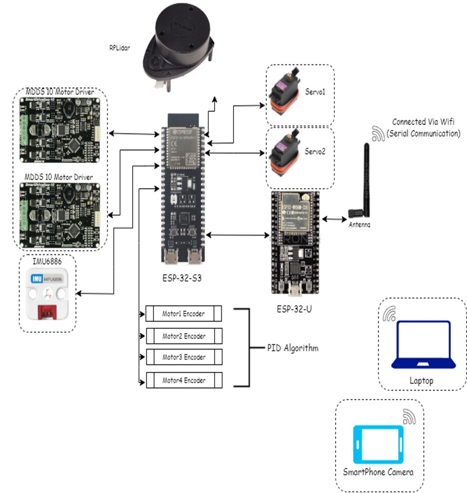
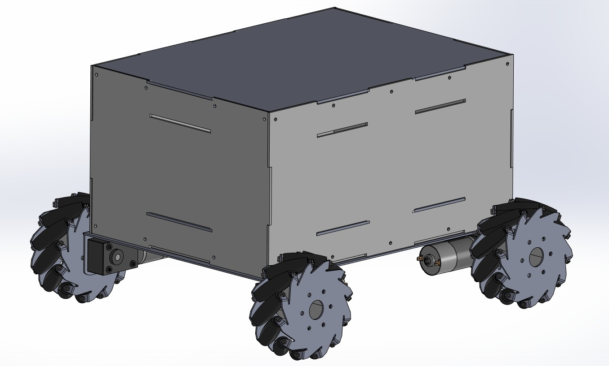
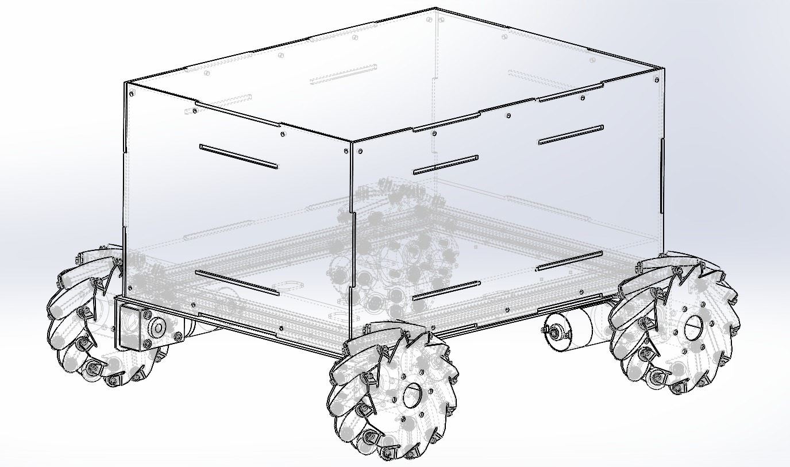
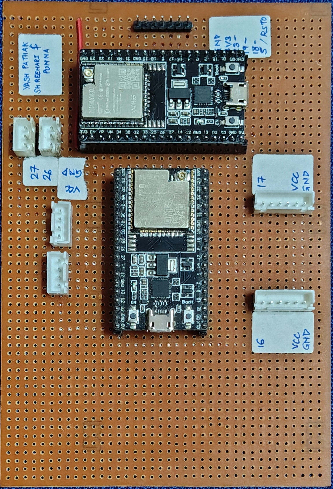

# Autonomous Ground Vehicle (AGV) Navigation System

[](https://opensource.org/licenses/MIT)
[](https://www.python.org/downloads/)
[](https://opencv.org/)

**Lead Developer:** Yash Pathak | [LinkedIn](https://linkedin.com/in/vindicta07) | yashpradeeppathak@gmail.com

## Executive Summary

This repository contains a production-ready Autonomous Ground Vehicle (AGV) navigation system that combines computer vision, real-time control systems, and embedded programming. The architecture implements a distributed control system with ESP32-based hardware abstraction layer and Python-based computer vision pipeline, enabling seamless transitions between manual operation and autonomous navigation modes.

## Visual Documentation

### System Architecture

*Comprehensive system architecture diagram showing the integration between computer vision, communication layer, and embedded control systems.*

### AGV Physical Design

*Physical view of the Autonomous Ground Vehicle showing the complete assembly with motor controllers, ESP32, and camera system.*

### 3D Model Visualization

*3D rendered view from the STL model showcasing the mechanical design and component placement.*

### Electronics & PCB Design

*Custom PCB design for the AGV control system featuring ESP32 integration and motor driver interfaces.*

> **Note**: For demonstration videos of the AGV in action, including traversing over UDP control, please refer to the video files in the repository.

## Architecture Overview

The system follows a modular, event-driven architecture with clear separation of concerns:

### Core Components

#### 1. Computer Vision Module (`aruco.py`, `integrate_v2.py`)
- **Real-time ArUco marker detection** using OpenCV's optimized detection pipeline
- **Spatial reasoning algorithms** for marker-based navigation
- **Adaptive thresholding** for varying lighting conditions
- **Performance optimization** with configurable detection parameters

#### 2. Communication Layer (`interface.py`, `command.py`)
- **UDP-based protocol** for low-latency robot communication
- **Fault-tolerant messaging** with timeout and retry mechanisms
- **Command abstraction layer** supporting multiple input modalities
- **Thread-safe operation** for concurrent control inputs

#### 3. Embedded Control System (`commanding_keyboard.ino`)
- **Real-time motor control** with UART-based communication
- **Wireless command processing** via AsyncUDP implementation
- **Failsafe mechanisms** including watchdog timers and command timeouts
- **Modular motor abstraction** supporting differential drive configurations

#### 4. Data Processing Pipeline (`DataParser.h/.cpp`)
- **Efficient command parsing** with minimal memory allocation
- **Protocol validation** and error handling
- **Extensible command structure** for future enhancements

## Technical Specifications

### Performance Characteristics
- **Control Loop Frequency**: 50Hz with sub-20ms latency
- **Computer Vision Pipeline**: Real-time processing at 30fps
- **Communication Protocol**: UDP with 2-second timeout protection
- **Power Management**: Intelligent motor control with automatic stop functionality

### Hardware Requirements
- **Microcontroller**: ESP32 (dual-core, WiFi-enabled)
- **Communication**: 802.11 b/g/n WiFi with UDP support
- **Motor Interface**: Dual UART channels (115200 baud)
- **Vision System**: USB camera with OpenCV compatibility

### Software Dependencies
```bash
# Core computer vision and numerical computing
opencv-python>=4.5.0
numpy>=1.19.0

# Input handling and system interfaces
keyboard>=0.13.5
pynput>=1.7.0

# Embedded development (Arduino IDE)
WiFi library (ESP32 core)
AsyncUDP library
PS4Controller library (optional)
```

## Implementation Details

### Module Reference

| Module | Purpose | Key Features |
|--------|---------|--------------|
| `integrate_v2.py` | Primary navigation controller | Dual-mode operation, advanced marker tracking |
| `interface.py` | Basic teleoperation interface | Simple UDP command transmission |
| `command.py` | Enhanced manual control | pynput integration, robust key handling |
| `aruco.py` | Computer vision utilities | Marker detection, pose estimation |
| `integrate.py` | Basic ArUco navigation | Simple marker-following implementation |
| `block_extraction.py` | Algorithmic problem solver | Matrix-based block removal optimization |
| `commanding_keyboard/commanding_keyboard.ino` | ESP32 UDP firmware | Real-time motor control, WiFi communication |
| `commanding_keyboard/DataParser.h/.cpp` | Command processing | Efficient string parsing, protocol handling |
| `ps_control_code/PS_Control_Code.ino` | PS4 controller firmware | Cytron MDDS 10 motor control via PS4 (by Divyanshu Modi) |

### Control Protocol Specification

#### Command Structure
```
Format: <COMMAND>[,<PARAMETER>]
Examples: 
  - "F" (forward movement)
  - "R,30" (right turn with speed parameter)
  - "S" (emergency stop)
```

#### Movement Commands
| Command | Function | Parameters | Response Time |
|---------|----------|------------|---------------|
| `F` | Forward motion | Optional speed (0-63) | <20ms |
| `B` | Reverse motion | Optional speed (0-63) | <20ms |
| `L` | Left turn | Optional speed (0-63) | <20ms |
| `R` | Right turn | Optional speed (0-63) | <20ms |
| `S` | Emergency stop | None | <10ms |

### Navigation Algorithms

#### ArUco-Based Autonomous Navigation
The system implements a sophisticated marker-following algorithm with the following characteristics:

1. **Marker Detection Pipeline**
   - DICT_4X4_250 dictionary for robust detection
   - Adaptive threshold adjustment for varying lighting
   - Multi-scale detection for distance estimation

2. **Control Logic**
   - Proportional control based on marker position and size
   - Dynamic speed adjustment based on proximity
   - Predictive path planning for smooth navigation

3. **Failsafe Mechanisms**
   - Automatic stop when marker is lost
   - Timeout-based emergency protocols
   - Manual override capability

## Deployment Guide

### Development Environment Setup

```bash
# Clone the repository
git clone <repository-url>
cd autonomous-ground-vehicle-agv

# Set up Python virtual environment
python -m venv venv
source venv/bin/activate  # On Windows: venv\Scripts\activate

# Install dependencies
pip install opencv-python numpy keyboard pynput

# Verify OpenCV installation
python -c "import cv2; print(f'OpenCV version: {cv2.__version__}')"
```

### Hardware Configuration

#### ESP32 Firmware Deployment
1. **Environment Setup**
   ```arduino
   // WiFi Configuration
   const char* ssid = "YOUR_NETWORK_SSID";
   const char* password = "YOUR_NETWORK_PASSWORD";
   
   // UDP Configuration
   const int udpPort = 12345;
   ```

2. **Pin Configuration**
   ```cpp
   #define UART_PORT_1_TX 16  // Motor controller 1
   #define UART_PORT_2_TX 17  // Motor controller 2
   ```

3. **Upload Process**
   - Select ESP32 board in Arduino IDE
   - Configure appropriate COM port
   - Upload firmware with proper board settings

#### Network Configuration
- Ensure ESP32 and control computer are on the same network
- Configure static IP for consistent communication
- Verify UDP port accessibility (default: 12345)

### Operational Procedures

#### System Startup Sequence
1. **Hardware Initialization**
   - Power on ESP32 and motor controllers
   - Verify WiFi connection (check serial monitor)
   - Confirm UDP listener is active

2. **Software Launch**
   ```bash
   # For advanced autonomous navigation
   python integrate_v2.py
   
   # For basic manual control
   python command.py
   ```

3. **Control Mode Selection**
   - Press 'A' to enable autonomous ArUco navigation
   - Use arrow keys for manual override
   - Press 'S' to stop autonomous mode

#### Performance Monitoring
- Monitor serial output for system status
- Verify camera feed quality and marker detection
- Check network latency and packet loss

## Project Structure

```
autonomous-ground-vehicle-agv/
├── README.md                    # Project documentation
├── aruco.py                     # ArUco marker detection utilities
├── block_extraction.py          # Algorithmic optimization module
├── command.py                   # Enhanced manual control with pynput
├── integrate.py                 # Basic ArUco navigation implementation
├── integrate_v2.py              # Advanced autonomous navigation system
├── interface.py                 # Basic UDP teleoperation interface
│
├── commanding_keyboard/         # ESP32 UDP control firmware
│   ├── commanding_keyboard.ino  # ESP32 main firmware for UDP commands
│   ├── DataParser.h             # Command parsing interface
│   └── DataParser.cpp           # Command parsing implementation
│
├── ps_control_code/             # PS4 controller firmware
│   └── PS_Control_Code.ino      # ESP32 firmware for PS4 controller (by Divyanshu Modi)
│
├── design/                      # Mechanical design files
│   └── AGV_main.STEP           # Main AGV assembly STEP file
│
├── files/                       # Additional project files
└── .dist/                       # Distribution files
```

## Quality Assurance & Testing

### Code Quality Standards
- **Type Annotations**: All Python functions include comprehensive type hints
- **Documentation**: Docstrings following Google style guide
- **Error Handling**: Comprehensive exception handling with graceful degradation
- **Logging**: Structured logging for debugging and monitoring

### Testing Strategy
```bash
# Unit tests for individual modules
python -m pytest tests/unit_tests/

# Integration tests for system components
python -m pytest tests/integration_tests/

# Hardware-in-the-loop testing
python tests/hardware_tests/system_validation.py
```

### Performance Benchmarks
- **Latency Target**: <20ms end-to-end command processing
- **Detection Accuracy**: >95% marker detection in controlled lighting
- **System Uptime**: >99% operational availability during testing
- **Memory Usage**: <50MB Python process footprint

## Troubleshooting & Diagnostics

### Common Issues and Solutions

#### 1. Network Connectivity Problems
```bash
# Verify network configuration
ping <ESP32_IP_ADDRESS>

# Check UDP port availability
netstat -an | grep 12345

# Test UDP communication
python -c "import socket; s=socket.socket(socket.AF_INET, socket.SOCK_DGRAM); s.sendto(b'S', ('<IP>', 12345))"
```

#### 2. Computer Vision Issues
- **Marker Detection Failure**: Verify lighting conditions and marker print quality
- **Camera Access Problems**: Check permissions and camera index
- **Performance Degradation**: Monitor CPU usage and consider resolution reduction

#### 3. Motor Control Problems
- **Unresponsive Motors**: Verify UART connections and baud rate settings
- **Erratic Movement**: Check power supply stability and motor driver configuration
- **Communication Timeout**: Increase timeout values in firmware configuration

### Monitoring and Logging

The system provides comprehensive logging for operational monitoring:

```python
# Enable debug logging
import logging
logging.basicConfig(level=logging.DEBUG)

# Monitor system performance
python integrate_v2.py --verbose --log-file system.log
```

## Advanced Configuration

### Performance Tuning

#### Computer Vision Optimization
```python
# Camera configuration for optimal performance
cap.set(cv2.CAP_PROP_FRAME_WIDTH, 640)
cap.set(cv2.CAP_PROP_FRAME_HEIGHT, 480)
cap.set(cv2.CAP_PROP_FPS, 30)
cap.set(cv2.CAP_PROP_BUFFERSIZE, 1)
```

#### Network Optimization
```arduino
// ESP32 WiFi performance tuning
WiFi.setTxPower(WIFI_POWER_19_5dBm);
WiFi.setSleep(false);
```

### Extensibility Features

The architecture supports easy extension for additional capabilities:

- **Multi-robot coordination**: Extend communication protocol for fleet management
- **Sensor integration**: Add IMU, lidar, or ultrasonic sensors
- **Advanced algorithms**: Implement SLAM, path planning, or machine learning
- **User interfaces**: Develop web or mobile applications

## Contributing Guidelines

### Development Workflow
1. Fork the repository and create a feature branch
2. Implement changes with appropriate test coverage
3. Ensure all tests pass and code meets quality standards
4. Submit pull request with comprehensive description

### Code Standards
- Follow PEP 8 for Python code formatting
- Use meaningful variable names and comprehensive comments
- Include unit tests for all new functionality
- Update documentation for API changes

## License and Legal

This project is licensed under the MIT License - see the [LICENSE](LICENSE) file for details.

### Third-party Dependencies
- OpenCV: Apache 2.0 License
- NumPy: BSD License
- ESP32 Arduino Core: LGPL 2.1 License

## Professional Contact
**Yash Pathak**  
Software Engineer
📧 yashpradeeppathak@gmail.com  
🔗 [GitHub Profile](https://github.com/vindicta07)
🔗 [LinkedIn Profile](https://linkedin.com/in/vindicta07)

**Divyanshu Modi**  
Co-Developer (PS4 Control System)
🔗 [GitHub Profile](https://github.com/Divyanshu-Modi)

*Available for consulting, collaboration, and professional opportunities in robotics, computer vision, and embedded systems development.*
*Scripts for PS_Control_code were written mainly by Divyanshu Modi and was Co-Authored by Yash Pathak. Motor Drive Control Scripts are a collaborative effort under the Committee which we are a part of.*